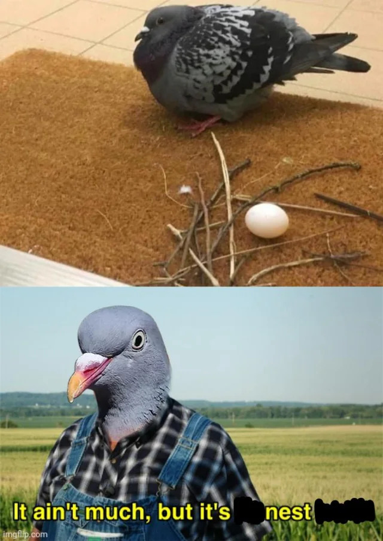
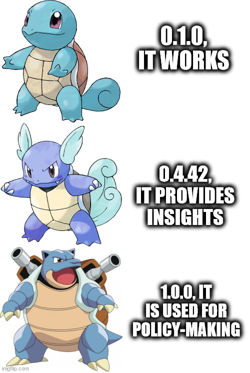

# Making Good Enough Models of Cities: A Beginners Guide

## Presumably Catchy Introduction

Urban analytics and city science are booming. The number of articles that begin with "By 2050, the number of people living in cities…" is getting out of hand. And you are also interested. Cool, cool, cool.

Want to be one of those who is creating computational models of cities? Fields like urban analytics, city science, urban data science, and GIS are all involved. These models can take many forms, whether visualising how heat is distributed over a city or network models examining the impact of traffic or urban resources.

And why do they make these models? The goal is to extract useful knowledge from these models and contribute to better decision-making. For example, together with Alexander Verbraeck, Tina Comes, and others (see the full lists [here](https://www.heros-project.eu/wp-content/uploads/HERoS_D2.1.pdf) and [here](https://www.heros-project.eu/wp-content/uploads/HERoS_D2.3-Coupled-epidemiological-models-and-scenario-analyses.pdf)), we made a simulation model of a city called [HERoS](https://github.com/averbraeck/medlabs-heros) that can be used to understand how the virus spread on the city scale and what can be done to tackle it. Another example, with my colleagues Leonardo Nicoletti and Trivik Verma, we developed [CityAccessMap.com](https://CityAccessMap.com), which was used to introduce a new indicator for SDG 11. Beyond utility, modelling cities is fascinating since you can reveal some hidden patterns.

You might ask: how do I do it? Oh well, here we go. This tutorial is not about modelling an entire city—an overly ambitious exercise. Instead, we'll model a specific problem a city faces. Creating a "generic" city model might be fun, but real modelling requires making tough decisions about what to include and leave out. Everything is connected, sure, but for now, we'll focus on modelling a specific problem and be brave about what we exclude.

Warning! This guide will offer some basic steps. It's not meant to be comprehensive but a starting point. Moreover, it's not meant to be complete but rather an invitation to look into something that could become an MSc course.

## What's a Good Enough Model?

First, let's have a talk about the *good enough* model, using different bird nests as metaphors to illustrate our point. What do I mean by "good enough"? Incomplete? Something deeply profound and lacking depth to be representative of the phenomena of interest? Just like a pigeon nest (Figure 2)? Or "we ran out of funding, and that's what we are" kind of model? Nope.

*Figure 2: Pigeons making nests be like. Credits go to [oranke_dino](https://www.reddit.com/user/oranke_dino/) on Reddit.*

A good enough model of a city is a model that is *sufficient* to generate *useful* insight. Sounds simple? However, let's unpack what sufficiency and usefulness in this context stand for.

With any complex system, a modeller has to make (hard) choices about what to include or exclude. In the context of cities, this decision-making process becomes particularly pronounced due to their inherent complexity and dynamic nature. Even a simple question, such as where the city ends, requires quite some thought. Should we set the model to be limited to official administrative borders, or should we also add surrounding areas where people live but commute into the city for work, effectively acting as its citizens? So, "sufficient" relates to the level of detail and the complexity of the model we aim to create.

For instance, consider a city where certain neighbourhoods are disproportionately affected by heatwaves due to factors like urban heat island effect (UHI), lack of green spaces, or socioeconomic disparities. If we exclude these factors from our model, we may miss essential dynamics affecting citizens' health outcomes. On the other hand, too much detail — such as modelling every building's materials — can make the model heavier than needed and difficult to interpret.

Contrary to the trend of developing digital twins of cities — which aim for exhaustive and highly detailed representations of every building, street, and infrastructure component — the concept of a "good enough" model acknowledges that any model we create is incomplete. Moreover, cities can be modelled from various perspectives, each emphasising different aspects such as transportation, energy consumption, social interactions, or environmental impact. By default, a model cannot capture every facet of the urban environment.

Consider the nests of sociable weavers, which are complex structures housing hundreds of birds (Figure 3). While impressive, such complexity is not our goal in modelling cities. Instead, we want to ask meaningful questions and seek empirical evidence to validate our modelling choices, ensuring that the model remains manageable and focused. By doing so, we avoid overcomplicating the model, which can lead to confusion, increased computational requirements, and difficulties in interpreting the results.

*Figure 3: Sociable weavers' nests are wild. Credits go to Wikipedia. The photo was taken by Harald Süpfle and licensed under CC-BY-SA-2.5. Read more [here](https://en.wikipedia.org/wiki/Sociable_weaver).*

Additionally, constructing a model of a city is a modular process. We can learn from software development methodologies, such as rapid prototyping and the "fail fast" philosophy. These approaches emphasise building iterative versions of a product, learning from each iteration, and making necessary adjustments quickly. Applying this to city modelling will allow us to develop models incrementally, testing and refining them as we progress. By starting with a simple model and gradually adding complexity, we can identify which components contribute most significantly to the insights we seek. (It is almost like inherently designing your modelling process for sensitivity analysis!)

For example, we might begin by modelling the UHI using basic parameters like air temperature and land surface characteristics. Then, we could incorporate additional factors such as vegetation cover, building materials, population density, or energy consumption patterns. At each stage, we assess whether the added complexity enhances our understanding of how heat waves impact the city or whether it unnecessarily complicates the model without providing significant benefits.

But what defines "useful" in the context of a model? Ultimately, usefulness is determined by you, the modeller, or the end-users for whom the model is intended. If the model generates insights that stakeholders find meaningful and actionable, then "your job is done here". For example, suppose a municipality lacks information about which neighbourhoods require more attention during heatwaves. If your model identifies these vulnerable areas and provides guidance for resource allocation, it is sufficient and useful.

Our aim is to achieve something similar to the nest of the great reed warbler (Figure 4): a structure that is simple yet complete, fulfilling its intended purpose without unnecessary complexity.

*Figure 4: The great reed warbler builds nests look good enough. Credits to Wikipedia. Image uploaded by Wikinoby~commonswiki under CC-BY-SA-3.0 Uported license. Read more [here](https://en.wikipedia.org/wiki/Bird_nest).*

In summary, a "good enough" model balances simplicity, complexity, sufficiency, and manageability. "Perfectly balanced...". It involves making thoughtful decisions about what to include based on the goals of the model and the needs of its users.

## Step 1: Define What to Model — A City or a Problem?

Before diving into modelling, it's crucial to identify the specific issue you want to address or ask an interesting question. Are you interested in the overall dynamics of a city, or are you focusing on a particular problem within the urban environment? This guide will concentrate on modelling a problem rather than attempting to model an entire city. Questions to consider:

1. What is the issue you're trying to address?
2. What kind of understanding is currently missing?
3. What questions do you hope your model will answer?

> **Task 1: Identify the Problem and Write It Down**
>
> Begin by writing down the problem you want to address. This initial definition might evolve as you deepen your understanding or find out that there is no data, but it's essential to start somewhere. Your problem statement can be a straightforward declaration or formulated as a question. For example:
>
> - *Heatwaves are causing significant health issues in urban areas.*
> - *How effective are the measures that could mitigate the impact of heatwaves in cities?*
>
> Defining the problem will guide your subsequent steps, including the selection of data, modelling approach, and analysis techniques.

## Step 2: Make a Conceptual Model

With your problem defined, developing A CONCEPTUAL MODEL is next. It sounds scary and tough, but we'll use some tricks to help us out. Long story short: identify **the key** components and relationships that are relevant only **to your** issue. And that's the first trick: we'll have to define the system's boundaries and make a hard but necessary decision about what to leave out.  

There are at least two approaches (ideally combined in a loop) to developing a conceptual model:

### Start with Theory or Get Ready for a Reading Challenge

You heard it right. You'll need to dive into existing literature to understand the theoretical underpinnings of your problem. Huh. The good news is the more you read, the easier it is. So, get ready to conduct a literature review to explore recent papers, books, and studies related to your topic. This will help you:

- Identify key variables and factors influencing the problem.
- Understand established relationships and mechanisms.
- Sheds a bit of light on previous modelling efforts and methodologies.

Example: If you're studying the impact of heat on citizens' health, you might search for keywords like "urban heat," "city temperature," "public health," "heatwaves," "emergency services," and "behavioural responses to heat." Starting broad and then narrowing your focus can help you capture a comprehensive picture of the issue.

A useful technique is to imagine your problem as a [black box](https://en.wikipedia.org/wiki/Black_box) with inputs, outputs, and internal structures. For instance, in the heat example:

- Inputs: Environmental heat levels, activation of policy interventions (e.g., heat action plans).
- Internal Structure: Urban infrastructure, population demographics, behavioural responses.
- Outputs: Reported mortality and morbidity rates due to heat.

Or, if you're familiar with it, consider drawing a systems diagram (read more in a truly amazing book [Policy Analysis of Multi-Actor Systems](https://textbooks.open.tudelft.nl/textbooks/catalog/book/50) by Enserink et al. (2023)), which can help visualise these components and their interconnections.

> **Task 2.1: Conduct a Literature Review and Draw a Conceptual Model of Your Problem**
>
> 1. Research articles, reports, and data sources relevant to your problem.
> 2. Identify key variables, factors, and relationships.
> 3. Create a visual representation (e.g., a diagram) of your conceptual model.

### Start with Data aka Mess Around and Find Out

Alternatively, you can begin by messing around with available data formally known as *exploratory data analysis* (EDA). Many institutions and organizations provide open-access datasets. I won't go over them; if you're reading this, you can search for information online. I would say that try exploring the websites of cities: e.g., [Barcelona](https://opendata-ajuntament.barcelona.cat/en/), [The Hague](https://denhaag.incijfers.nl/jive), [Helsinki](https://www.hsy.fi/en/environmental-information/open-data/search/?query=age&orderby=date&category=). Large organisations typically (but not always) provide data on the country scale.

**When starting with data**:

- Search datasets relevant to your problem.
- Look for variables that might influence or explain the issue.
- Conduct exploratory data analysis to uncover patterns and relationships.

Example: In the heat scenario, you might gather data on temperature variations across different districts, socio-demographic information, healthcare access, and energy usage. Analysing this data could reveal correlations between temperature and population density, income levels, or health outcomes.

Another tip! Want to save yourself a ton of time? Use [Cookiecutter Data Science](https://cookiecutter-data-science.drivendata.org/) for your EDA. I cannot stress enough how easier your life would be if you started with a structured approach for any of your data science projects. Ok, I'll try. A LOT!

> **Task 2.2: Find Data and List Variables**
>
> 1. Identify and collect datasets that could inform your problem.
> 2. List the variables that are relevant.
> 3. Analyse the data to discover patterns and relationships.

### Special Considerations When Modeling Cities

#### Think Modular

Cities can be broken down into building blocks (e.g., roads, buildings, utilities). Recognising these modules helps structure your model. For example:

- Roads are used by people and vehicles to move around the city.
- Energy system powers public infrastructure like libraries, hospitals, and schools.

Running out of ideas? Try to play any city simulator, even on your phone. Look at what are the building blocks the game offers and think whether these are relevant to your problem.

#### Urban Dynamics, which is Spatio-Temporal

Urban environments are dynamic. People use roads to move around, energy consumption fluctuates, and services operate on schedules. Your model should account for these dynamic interactions.

As a result, urban phenomena often vary across space and time. While visualising data on a map is helpful, remember that processes change over time. Search for spatio-temporal data and, in the worst-case scenario, complement spatial with temporal data.

#### Urban Inequalities

Modern cities often have disparities in income, access to services, and environmental quality. Be cautious when interpreting correlations between inequalities and the phenomena you're studying. Ensure that your analysis accounts for confounding factors.

#### When to Stop Adding Complexity

Aim for a "good enough" model to address your problem without unnecessary complexity. Starting simple allows you to focus on core elements and understand fundamental relationships. You can always add complexity later as needed. Initially, limit yourself to:

- A manageable number of core elements or datasets (e.g., five).
- A few key connections between variables.

#### Working Alone or With Others

While working alone is OK, working with others can significantly enrich your model by bringing in different perspectives and expertise. Modelling is an exercise that is always done from someone's "perspective". That's why [participatory modelling](https://en.wikipedia.org/wiki/Participatory_modeling) is considered to be more effective than when no stakeholders evolved.

## Step 3: Select the Model Type

Now that you have a conceptual model and some initial understanding of your problem, it's time to choose the appropriate modelling approach. The model type you select should align with the nature of your problem, the data available, and the insights you aim to generate.

As the old cliche goes, "It is tempting, if the only tool you have is a hammer, to treat everything as if it were a nail." ([The Law of the Instrument](https://en.wikipedia.org/wiki/Law_of_the_instrument)). Therefore, it's important to be open to different modelling techniques rather than forcing your problem into a familiar framework. On the other hand, you are faced with a dilemma: either learn multiple tools or restrict yourself to solving problems that fit within the capabilities of your current tool. It's important not to be overly rigid here — there's value in stepping outside the conventional uses of a tool and applying it to new challenges. However, be careful. Read Russell Ackoff's ["On the Mismatch Between Systems and Their Models"](https://www.researchgate.net/publication/228919705_On_the_mismatch_between_systems_and_their_models) before diving into the complexities of tool selection.

Here are some common model types used in urban modelling:

### Simulation Models

- Agent-Based Models (ABM): Simulate the actions and interactions of autonomous agents (e.g., individuals, households, vehicles) to assess their effects on the system as a whole. Useful for modelling complex behaviours, emergent phenomena, and heterogeneous populations.
- System Dynamics Models (SD): Use stocks, flows, feedback loops, and time delays to understand the behaviour of complex systems over time. Ideal for studying aggregate trends, policies, and long-term dynamics.
- Discrete Event Simulation (DES): Model the system as a sequence of events in time, suitable for systems where changes occur at discrete points (e.g., public transport schedules, emergency response).

### Statistical Models

- Regression and Correlation: Identify patterns and relationships between variables. Useful for predicting outcomes and understanding influencing factors.
- Clustering and Dimensionality Reduction: Use algorithms to find patterns.
- Time-Series: Analyse data points collected or recorded at specific time intervals to identify trends and seasonal variations.

Certainly! I'll continue from Step 3 where we left off:

### Indicators and Indices

Create composite measures to represent complex phenomena (e.g., livability index, heat vulnerability index). Relatively easy to make and interpret, familiar to policy-makers and practitioners.

### Network Models

Focus on the relationships and interactions between entities, such as transportation and social networks. Analyse flows, connectivity, centrality, and vulnerability within networks.

### Geographic Information System (GIS)-Based Models

Utilise GIS to analyse spatial data and visualise results on maps. Good for spatial analysis, location-based modelling, and integrating various spatial datasets.

### How to Select the Appropriate Model Type

Here are some factors to consider when choosing your model:

1. Nature of the Problem:
   - Is the problem dynamic or static?
   - Does it involve individual entities or aggregate behaviour?
   - Are spatial or temporal aspects critical?

2. Data Availability:
   - Do you have detailed micro-level data or aggregate data?
   - Is the data quantitative, qualitative, or both?

3. Desired Insights:
   - Are you interested in predicting future states, exploring scenarios, or understanding underlying mechanisms?
   - Do you need to visualise spatial patterns?

4. Complexity and Resources:
   - What is the acceptable level of complexity?
   - What are your computational resources and time constraints?
   - What is your expertise with different modelling techniques?

Here are some examples:

- If you are studying how individual behaviours contribute to virus spread, an ABM might be appropriate.
- If you want to understand how different policies affect overall virus spread in a city over time, an SD model could be suitable.
- For analysing the spatial distribution of heat vulnerability across a city, a GIS-Based Model with statistical analysis may be the best approach.

Note that further in the tutorial, we'll focus on a few models to make this tutorial more tangible and not turn it into a book: simulation (mainly ABM), statistical and indicator-based.

## Step 4: Collect and Prepare Data

Data is the foundation of your model. Collecting and preparing data involves sourcing relevant datasets, ensuring their quality, and formatting them for use in your modelling tools. As the saying goes, "Garbage in, garbage out." The quality of your data directly affects the reliability of your model's outputs. Sometimes, the data you need might not be available or might not match your initial expectations. Be prepared to revisit your conceptual model or adjust your problem statement based on the data you can obtain.

There is plenty of information about collecting and preparing the data. Overall, you'll have to familiarise yourself with the platforms that store the data you want. As we previously discussed, these are most likely the ones run by cities. Data preparation-wise, [here](https://khuyentran1401.github.io/reproducible-data-science/README.html) is a great tutorial entitled "Build a Reproducible and Maintainable Data Science Project" by Khuyen Tran. Some of the tools described here (e.g., Great Expectations or Pandera) can be quite useful for data preparation/preprocessing.

> **Task 4: Collect and Prepare Data**
>
> 1. **Data Collection**:
>    - Identify and download the datasets relevant to your model.
>    - Ensure you have permission to use the data.
> 2. **Data Preparation**:
>    - Clean and preprocess the data.
>    - Document your data sources and any changes made.
> 3. **Revisit Conceptual Model** (if necessary):
>    - Assess whether the data collected supports your conceptual model.
>    - Modify your model or problem statement if required.

## Step 5: Make the Model

Now comes the exciting part — building your model! This step involves translating your conceptual model into a computational one using appropriate tools and techniques.

Since there are plenty of excellent tutorials on building different types of models, I'm exempted from going into details regarding each of them here! Hooray! For example, [Agent-Based Modelling of Socio-Technical Systems](https://link.springer.com/book/10.1007/978-94-007-4933-7) or the [tutorials](https://gama-platform.org/) provided by the GAMA Platform. However, let's go over the steps that are common regardless of the model type you've selected:

1. **Choose the Right Tools**:
   - For ABMs, consider platforms like [Mesa](https://mesa.readthedocs.io/stable/), [GAMA](https://gama-platform.org/), or [PYDSOL](https://github.com/averbraeck/pydsol-core).
   - For statistical models, programming languages like Python (with libraries such as pandas, scikit-learn) or R are commonly used.
   - For GIS-based models, open-source tools like [QGIS](https://www.qgis.org/en/site/) are very useful.

2. **Translate the Conceptual Model**:
   - Define the variables, parameters, and equations that represent the relationships in your conceptual model.
   - For simulation models, code the behaviours, rules, and interactions of agents or system components.

Since you're modelling a complex system that is likely to involve a significant amount of uncertainty, addressing uncertainty is not that easy. People even have [dedicated Twitter accounts for that](https://x.com/dmdu_memes)! Consider using decision-making under deep uncertainty (DMDU) methods. You can read more about it [DMDU Society](https://www.deepuncertainty.org/).

Lastly, remember the key principles we discussed in the previous steps: **aim for good enough**, **be modular**, **think spatio-temporally**, **account for inequalities**, and **work with others**.

> **Task 5: Build Your Model**
>
> 1. **Set Up the Development Environment**:
>    - Install and configure the necessary software and tools.
> 2. **Implement the Model**:
>    - Translate your conceptual model into code or a computational framework.
>    - Ensure that your code is well-organised and documented.
> 3. **Test the Model Iteratively**:
>    - Run the model with test data or parameters.
>    - Debug and refine as needed.

## Step 6: Analyse and Visualise Results

Analysing the results of an already-built model can be a lot of fun. This step involves puzzling over outputs, performing further analysis, and presenting your findings in an accessible manner (data storytelling!).

Depending on your model type and objectives, your analysis may include statistical analysis to ensure that the type of relations you've found hold true,  sensitivity analysis to identify which factors most significantly affect the outcomes, spatial analysis using GIS tools to examine patterns and relationships, and temporal analysis to observe how variables change over time.

Visualisation is key to understanding and communicating your findings. Create graphs and charts, but start simple with some pre-built libraries (e.g., matplotlib), but later explore mode advanced ways to visualise data, e.g., with [Observable HQ](https://observablehq.com/). Similarly, make some simple maps that display spatial data and patterns, and later explore advanced topics, e.g., [interactive storytelling](https://www.mapbox.com/solutions/interactive-storytelling) by Mapbox. For dynamic models, animations or interactive dashboards such as [Dash](https://www.google.com/search?client=firefox-b-d&q=plotlyu+dashbora), [Streamlit](https://streamlit.io/), or [HoloViz](https://examples.holoviz.org/gallery/datashader_dashboard/datashader_dashboard.html) can illustrate how the system evolves over time.

Presenting your results effectively requires careful consideration, especially when addressing non-experts. Surprisingly, simply throwing graphs at them doesn't work! Simplify complex data by using clear and straightforward visuals and focusing on the key message. Structure your presentation in a way that tells a coherent story. Use the audience language, avoid jargon at all costs and explain technical terms ONLY WHEN NECESSARY.

> **Task 6: Analyse and Visualise Your Model's Results**
>
> 1. **Perform Data Analysis**:
>    - Run statistical analyses relevant to your objectives.
>    - Conduct scenario and sensitivity analyses as planned.
> 2. **Create Visualizations**:
>    - Generate graphs, charts, and maps to represent your findings.
>    - Ensure visuals are clear and effectively convey the intended message.
> 3. **Prepare to Communicate Results**:
>    - Develop a narrative that explains your findings.
>    - Consider the audience and tailor your presentation accordingly.

## Step 7: Verify and Validate

Verification ensures that your model is correctly implemented, and validation is about whether it represents a real-world problem. As such, verification is more applicable to simulation models than to statistical or indicator-based models. Validation can be done for both.

What is it all about in a nutshell? Verification of a simulation means checking whether everything works as intended. For instance, you'll need to check all outcomes, the main and secondary ones. It is quite a tough process, but that's how you'll make sure that the model does not have any bugs. If the model is complex and has multiple submodels, first perform verification of its individual submodels, then take two or three interacting ones and check them, and so on, until you make sure that the main model outcomes are correct.

Next comes validation. And this one could be tricky. If you model a phenomenon that happened in the past, then you can perform historical validation.  Historical validation is possible if past data exists, but it might not apply if your model addresses scenarios that haven't occurred. In such cases, you may consider using expert validation for the overall performance metrics of your model and use historical validation for individual components of your model. Some say the ultimate test of a model's validity is its usefulness.

> **Task 7: Verify and Validate Your Model**
>
> 1. **Verification**:
>    - Conduct thorough testing to ensure the model operates correctly.
> 2. **Validation**:
>    - Compare model outputs with real-world data or expert expectations.
>    - Document validation processes and findings.
> 3. **Refinement**:
>    - Make necessary adjustments based on verification and validation results.

## Instead of Conclusion

As we agreed in the beginning, it's not a comprehensive guide but just an attempt to compile into a set of meaningful steps supervised with tips. I didn't cover many topics here: open data, ethical implications, communicating models and their results, equifinality, but it also means there is so much to explore. Everyone would like to have that single piece of text, a tutorial, or a video that would be comprehensive but to be point, contain multiple examples, be deep and focused, and so on. Do you see where it's going? Yes, it doesn't exist, at least yet. I think it could be said that there are MSc-level courses. Or maybe a full-scale program? Nah, it is so much more fun to gather this knowledge from various sources. I hope you got the main idea and start making good enough models that will eventually evolve into something beautiful and useful, like in Figure 5.

*Figure 5: Evolution of good enough models be like. Created by Mikhail Sirenko with [imgflip.com](https://imgflip.com) and available at [https://imgflip.com/i/954kvi](https://imgflip.com/i/954kvi).*
